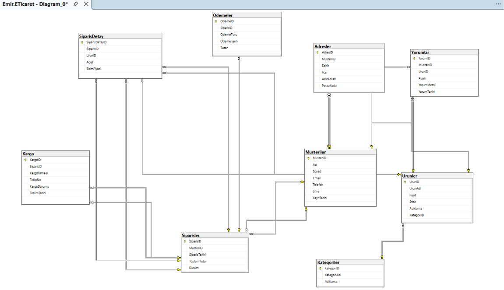

# E-Ticaret-Veritabani
SQL Server ile hazırlanmış E-Ticaret Veritabanı Projesi

## Proje Hakkında

Bu proje, Microsoft SQL Server kullanılarak geliştirilmiş ilişkisel bir e-ticaret veritabanı tasarımıdır. Bir e-ticaret platformunun temel iş süreçleri dikkate alınarak oluşturulmuş olup müşteri, ürün, sipariş, ödeme, kargo ve yorum yönetimi gibi temel bileşenleri kapsamaktadır.

Veritabanı tasarlanırken veri bütünlüğü, ilişkisel yapı ve normalizasyon prensipleri esas alınmıştır. Tablolar arasındaki ilişkiler Primary Key ve Foreign Key yapıları kullanılarak oluşturulmuştur.

---

## Kullanılan Teknolojiler

- Microsoft SQL Server
- SQL Server Management Studio (SSMS)
- SQL

---

## Veritabanı Yapısı

Projede aşağıdaki tablolar bulunmaktadır.

| Tablo | Açıklama |
|-------|----------|
| Musteriler | Müşteri bilgilerini tutar. |
| Adresler | Müşterilere ait adres bilgilerini içerir. |
| Kategoriler | Ürün kategorilerini içerir. |
| Urunler | Satışa sunulan ürün bilgilerini içerir. |
| Siparisler | Oluşturulan sipariş kayıtlarını tutar. |
| SiparisDetay | Sipariş içerisindeki ürünleri tutar. |
| Odemeler | Siparişlere ait ödeme bilgilerini içerir. |
| Kargo | Siparişlerin kargo bilgilerini içerir. |
| Yorumlar | Müşterilerin ürünlere yaptığı yorumları içerir. |

---

## Veritabanı İlişkileri

- Bir müşteri birden fazla sipariş oluşturabilir.
- Bir sipariş yalnızca bir müşteriye aittir.
- Bir sipariş birden fazla üründen oluşabilir.
- Her ürün yalnızca bir kategoriye bağlıdır.
- Her sipariş için ödeme bilgisi tutulabilir.
- Her sipariş için kargo bilgisi tutulabilir.
- Müşteriler satın aldıkları ürünlere yorum yapabilir.

---

## Veritabanı Diyagramı

<p align="center">
    
</p>

---

## Kurulum

1. Microsoft SQL Server Management Studio'nu açın.
2. Yeni bir veritabanı oluşturun.
3. `eticaret.sql` dosyasını açın.
4. Script'i çalıştırın.
5. Tablolar ve örnek veriler otomatik olarak oluşturulacaktır.

---

## Proje Kapsamında Uygulanan Konular

- İlişkisel veritabanı tasarımı
- Primary Key kullanımı
- Foreign Key kullanımı
- Veri bütünlüğü
- Normalizasyon
- Tablolar arası ilişkiler
- Temel SQL sorguları
- Örnek veri yönetimi

---

## Proje Dosyaları

```
E-Ticaret-Veritabani
│
├── eticaret.sql
├── diagram.png
└── README.md
```

---

## Geliştirici

**Emir Han Ertaş**

Bilgisayar Mühendisliği Öğrencisi

Bu proje eğitim ve portföy amacıyla geliştirilmiştir.
